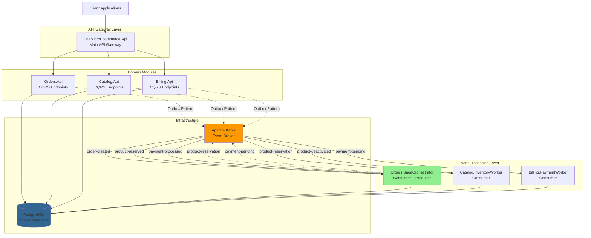
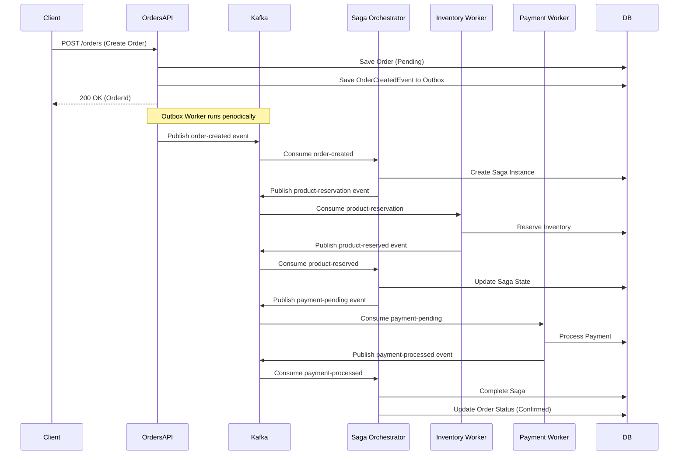

# Event-Driven Mini E-Commerce System

## Project Overview & Scope

### Project Title
**EDA Mini E-Commerce** - A modular monolith e-commerce platform demonstrating Event-Driven Architecture patterns

### Purpose & Goal

This project demonstrates a production-ready implementation of an e-commerce system using **Event-Driven Architecture (EDA)** principles. The system addresses the challenge of building loosely-coupled, scalable modules that can evolve independently while maintaining data consistency through event-driven communication.

**Problem Statement:** Traditional tightly-coupled monolithic e-commerce systems face scalability and maintainability challenges. Tight coupling between components makes it difficult to scale individual features or adapt to changing business requirements.

**Solution:** This project implements a modular monolith architecture where modules communicate asynchronously through events, enabling:
- Clear separation of concerns and business domains through modules
- Resilient system operation (failures in one module don't cascade)
- Eventual consistency with the Saga pattern for complex transactions
- Ability to evolve towards microservices if needed

### Event-Driven Architecture (EDA) Summary

**Why EDA was chosen:**
- **Loose Coupling**: Modules communicate through events without direct dependencies, allowing independent development
- **Scalability**: The modular structure allows targeted optimization and future extraction of modules into separate services
- **Resilience**: Asynchronous communication with message persistence ensures no data loss during failures
- **Auditability**: Event streams provide a complete audit trail of all system activities
- **Flexibility**: New modules can subscribe to existing events without modifying publishers

**Key Benefits for this Project:**
- **Order Processing**: Complex multi-step workflows (order → inventory → payment) handled reliably through the Saga pattern
- **Inventory Management**: Real-time stock updates across multiple modules without tight coupling
- **Payment Processing**: Asynchronous payment processing improves user experience and system reliability
- **System Evolution**: New features (e.g., notifications, analytics) can be added by subscribing to existing events
- **Deployment Simplicity**: Single deployment unit with modular organization reduces operational complexity

### Core Concepts

**Events**: Immutable facts representing something that happened in the system (e.g., `OrderCreated`, `PaymentProcessed`). Events carry all necessary data for consumers to act upon them.

**Producers (Publishers)**: Modules that create and publish events when significant business actions occur. In this system:
- **Orders API** publishes `OrderCreated` events
- **Catalog Service** publishes `ProductDeactivated` and `ProductReserved` events
- **Billing Service** publishes `PaymentProcessed` events

**Consumers (Subscribers)**: Modules that listen for specific events and react accordingly. Each consumer maintains its own state:
- **Saga Orchestrator** coordinates multi-step workflows
- **Inventory Worker** manages stock levels
- **Payment Worker** processes payments

**Event Broker/Bus**: Apache Kafka acts as the central message broker, providing:
- Persistent event storage
- Guaranteed message delivery
- Event ordering within partitions
- Horizontal scalability through partitioning

---

## Technical Stack & Dependencies

### Core Languages & Frameworks
- **.NET 8.0** (C#) - Primary development framework
- **ASP.NET Core** - Web API and hosting
- **Entity Framework Core 9.0** - ORM for database access
- **MediatR** - In-process messaging and CQRS pattern implementation
- **Carter** - Minimal API endpoint routing

### Event Broker
- **Apache Kafka** - Distributed event streaming platform
  - **KafkaFlow** - .NET library for Kafka integration
  - **KafkaUI** - Web-based Kafka management interface (port 9100)
  - Bootstrap server port: 59481

### Databases
- **PostgreSQL 9.0** - Single shared database for all modules (modular monolith pattern)
  - Port: 5450
  - Schema separation per bounded context for logical isolation
  - **EFCore.NamingConventions** - Snake_case naming for database entities

### Infrastructure
- **.NET Aspire** - Cloud-native application orchestration
- **Docker** - Containerization for PostgreSQL and Kafka
- **OpenTelemetry** - Distributed tracing and observability
  - OTLP Exporter for metrics and traces
  - ASP.NET Core and HTTP instrumentation
- **Npgsql.OpenTelemetry** - PostgreSQL tracing

### Additional Libraries
- **Scrutor** - Assembly scanning and decoration
- **Swashbuckle (Swagger)** - API documentation

---

## System Architecture & Flow

### High-Level Architecture Diagram



### Event Flow: Order Processing Example



### Event Catalog

| Event Name | Source Service | Payload Schema | Purpose |
|------------|---------------|----------------|---------|
| `order-created` | Orders.Api | `OrderId`, `List<ProductOrderInfo>` | Signals a new order has been placed and needs processing |
| `product-reservation` | Orders.SagaOrchestrator | `OrderId`, `ProductId`, `Quantity`, `ReservationType` (Reserve/Release) | Requests inventory reservation or release for an order |
| `product-reserved` | Catalog.InventoryWorker | `OrderId`, `ProductId`, `Quantity`, `ReservationStatus` | Confirms inventory was successfully reserved or reports failure |
| `payment-pending` | Orders.SagaOrchestrator | `OrderId`, `TotalAmount`, `CustomerId` | Initiates payment processing for an order |
| `payment-processed` | Billing.PaymentWorker | `PaymentId`, `OrderId`, `PaymentStatus` | Reports payment processing result (Success/Failed) |
| `product-deactivated` | Catalog.Api | `ProductId` | Notifies that a product has been deactivated and should not be sold |
| `product-low-stock` | Catalog.Domain | `ProductId`, `CurrentStock`, `Threshold` | Internal event for low stock alerts |

### Component Breakdown

#### 1. **EdaMicroEcommerce.Api** (Main API Gateway)
- **Role**: Producer (publishes events via Outbox workers)
- **Responsibilities**: 
  - HTTP endpoint aggregation
  - Request routing to domain modules
  - Outbox workers for reliable event publishing
  - Exception handling and observability
- **Events Published**: All domain events via Outbox pattern
- **Events Consumed**: None

#### 2. **Orders.Api** (Orders Domain Module)
- **Role**: Producer
- **Responsibilities**:
  - Order CQRS operations
  - Order entity management
  - Domain event creation
- **Events Published**: `order-created`, `order-canceled`, `order-item-removed`
- **Events Consumed**: None

#### 3. **Orders.SagaOrchestrator** (Saga Coordinator)
- **Role**: Both Producer and Consumer
- **Responsibilities**:
  - Orchestrate order workflow across modules
  - Manage saga state and compensation logic
  - Ensure eventual consistency across modules
- **Events Published**: `product-reservation`, `payment-pending`
- **Events Consumed**: `order-created`, `product-reserved`, `payment-processed`
- **Pattern**: Saga orchestration pattern

#### 4. **Catalog.Api** (Catalog Domain Module)
- **Role**: Producer
- **Responsibilities**:
  - Product CQRS operations
  - Product lifecycle management
  - Inventory tracking
- **Events Published**: `product-deactivated`, `product-low-stock`
- **Events Consumed**: None

#### 5. **Catalog.InventoryWorker** (Inventory Management Worker)
- **Role**: Consumer
- **Responsibilities**:
  - Process inventory reservations
  - Handle product deactivation
  - Maintain stock levels
- **Events Published**: `product-reserved` (via domain events)
- **Events Consumed**: `product-reservation`, `product-deactivated`

#### 6. **Billing.Api** (Billing Domain Module)
- **Role**: Producer
- **Responsibilities**:
  - Payment CQRS operations
  - Payment entity management
- **Events Published**: Domain events for payment state changes
- **Events Consumed**: None

#### 7. **Billing.PaymentWorker** (Payment Processing Worker)
- **Role**: Consumer
- **Responsibilities**:
  - Process payment requests
  - Integrate with payment gateways (simulated)
  - Update payment status
- **Events Published**: `payment-processed` (via domain events)
- **Events Consumed**: `payment-pending`

#### 8. **Platform.** (Shared Infrastructure)
- **Components**:
  - `Platform.Domain`: Base domain building blocks (IDomainEvent, Entity, ValueObject)
  - `Platform.Application`: Outbox pattern implementation
  - `Platform.Infra`: Kafka configuration, message broker setup
  - `Platform.SharedContracts`: Integration event contracts

---

## Local Setup & Deployment

### Prerequisites

Before starting, ensure you have the following installed:

- **.NET SDK 8.0.415** or later ([Download](https://dotnet.microsoft.com/download))
- **Docker Desktop** ([Download](https://www.docker.com/products/docker-desktop))
- **Git** ([Download](https://git-scm.com/downloads))
- **IDE** (Visual Studio 2022, JetBrains Rider, or VS Code with C# extension)

Optional but recommended:
- **Kafka CLI tools** for debugging
- **pgAdmin** or similar PostgreSQL client

### Installation Steps

1. **Clone the repository**
   ```bash
   git clone https://github.com/LeoGCRocha/eda-mini-ecommerce.git
   cd eda-mini-ecommerce
   ```

2. **Verify .NET SDK version**
   ```bash
   dotnet --version
   # Should output 8.0.415 or later
   ```

3. **Restore dependencies**
   ```bash
   dotnet restore
   ```

4. **Run the application using .NET Aspire**
   
   The project uses .NET Aspire for orchestration, which automatically manages Docker containers for Kafka and PostgreSQL:
   
   ```bash
   dotnet run --project src/EdaMicroEcommerce.AppHost/EdaMicroEcommerce.AppHost.csproj
   ```

   This command will:
   - Start PostgreSQL container on port 5450
   - Start Kafka container on port 59481
   - Start KafkaUI on port 9100
   - Launch all modules (API, Workers, Saga Orchestrator) as a single application
   - Open Aspire Dashboard in your browser

5. **Access the services**
   
   Once running, you can access:
   - **Aspire Dashboard**: `http://localhost:15000` (auto-opens)
   - **Swagger API Documentation**: Check Aspire dashboard for API URL
   - **KafkaUI**: `http://localhost:9100`
   - **PostgreSQL**: `localhost:5450` (credentials below)

6. **Verify Kafka topics**
   
   Open KafkaUI at `http://localhost:9100` and verify these topics exist:
   - `order-created`
   - `product-reservation`
   - `product-reserved`
   - `payment-pending`
   - `payment-processed`
   - `product-deactivated`

### Alternative: Manual Docker Setup

If not using .NET Aspire, you can start infrastructure manually:

```bash
# Start infrastructure using Docker Compose
docker-compose up -d

# Run migrations (if any)
dotnet ef database update --project src/Orders.Infra
dotnet ef database update --project src/Catalog.Infra
dotnet ef database update --project src/Billing.Infra

# Start each module manually (development only - normally run together via AppHost)
dotnet run --project src/EdaMicroEcommerce.Api
dotnet run --project src/Orders.SagaOrchestrator
dotnet run --project src/Catalog.InventoryWorker
dotnet run --project src/Billing.PaymentWorker
```

### Environment Variables

The following environment variables can be configured in `appsettings.json` or `appsettings.Development.json`:

#### Database Configuration
```json
{
  "ConnectionStrings": {
    "EdaMicroDb": "Host=localhost;Port=5450;Username=postgres;Password=8CJMVMc*+0r*HuMcPXmc6k;Database=EdaMicroDb"
  }
}
```

**Variables:**
- `Host`: PostgreSQL server hostname (default: `localhost`)
- `Port`: PostgreSQL port (default: `5450`)
- `Username`: Database user (default: `postgres`)
- `Password`: Database password (default: `8CJMVMc*+0r*HuMcPXmc6k`)
- `Database`: Database name (default: `EdaMicroDb`)

#### Message Broker Configuration
```json
{
  "MessageBroker": {
    "BootstrapServers": "localhost:59481",
    "Consumers": {
      "<ConsumerName>": {
        "GroupId": "consumer-group-name",
        "Topic": "topic-name",
        "Config": {
          "auto.offset.reset": "earliest"
        }
      }
    }
  }
}
```

**Variables:**
- `BootstrapServers`: Kafka broker address (default: `localhost:59481`)
- `GroupId`: Consumer group identifier for offset management
- `Topic`: Kafka topic name to consume
- `auto.offset.reset`: Start consuming from `earliest` or `latest` message

#### OpenTelemetry Configuration
```json
{
  "OTEL_SERVICE_NAME": "service-name",
  "OTEL_EXPORTER_OTLP_ENDPOINT": "http://localhost:4317"
}
```

**Variables:**
- `OTEL_SERVICE_NAME`: Service identifier for distributed tracing
- `OTEL_EXPORTER_OTLP_ENDPOINT`: OpenTelemetry collector endpoint

---

## Operation & Troubleshooting

### Monitoring & Logging

#### Distributed Tracing
The system uses **OpenTelemetry** for distributed tracing:

- **Configuration**: Each service exports traces to OTLP endpoint
- **Instrumentation**: 
  - ASP.NET Core requests
  - HTTP client calls
  - Entity Framework queries
  - Kafka message processing
- **Service Names**:
  - `eda-ecommerce-catalog`
  - `eda-ecommerce-billing`
  - `eda-ecommerce-orders`

**Viewing Traces**: Configure an OTLP collector (Jaeger, Zipkin, or .NET Aspire Dashboard)

#### Logging
- **Provider**: Microsoft.Extensions.Logging (built-in)
- **Log Levels**: Configured in `appsettings.json`
  ```json
  "Logging": {
    "LogLevel": {
      "Default": "Information",
      "Microsoft.AspNetCore": "Warning",
      "Microsoft.EntityFrameworkCore": "Warning"
    }
  }
  ```
- **Kafka Logging**: KafkaFlow.LogHandler.Console and Microsoft integrations

#### Recommended Observability Stack (Optional)
For production-like monitoring, consider:
- **Prometheus**: Metrics collection
- **Grafana**: Metrics visualization
- **ELK Stack** (Elasticsearch, Logstash, Kibana): Centralized logging
- **Jaeger**: Distributed tracing backend

### Testing Strategy

#### Unit Testing
- **Focus**: Domain logic, business rules, value objects
- **Tools**: xUnit (recommended for .NET)
- **Pattern**: Test domain entities and aggregates in isolation

#### Integration Testing
- **Focus**: API endpoints, database operations, event publishing
- **Tools**: WebApplicationFactory for API testing
- **Pattern**: Test with in-memory database or test containers

#### Event Replay Testing
- **Purpose**: Verify system can recover from failures and rebuild state
- **Approach**:
  1. Capture events from Kafka topics
  2. Reset consumer offsets: `auto.offset.reset: earliest`
  3. Replay events and verify state consistency
  4. Validate idempotency

**Example: Manual Event Replay**
```bash
# Reset consumer group offset to beginning
kafka-consumer-groups --bootstrap-server localhost:59481 \
  --group order-saga-orchestrator \
  --topic order-created \
  --reset-offsets --to-earliest --execute

# Restart the consumer to replay events
dotnet run --project src/Orders.SagaOrchestrator
```

#### Consumer Testing Best Practices
- **Idempotency**: Ensure handlers can process the same event multiple times
- **Ordering**: Test event processing with out-of-order delivery
- **Error Handling**: Verify retry logic and dead-letter queues

### Common Issues & Solutions

#### 1. **Idempotency Failures**

**Symptom**: Duplicate events cause inconsistent state (e.g., double inventory reservation)

**Causes**:
- Consumer processes same message twice (retry, rebalancing)
- Event published multiple times due to outbox worker issues

**Solutions**:
- Implement idempotency keys (e.g., `OrderId` + `EventId`)
- Use database constraints (unique indexes)
- Store processed event IDs in database
- Example pattern:
  ```csharp
  var alreadyProcessed = await _db.ProcessedEvents
      .AnyAsync(e => e.EventId == message.EventId);
  
  if (alreadyProcessed) 
      return; // Skip duplicate
  
  // Process event...
  
  await _db.ProcessedEvents.AddAsync(new ProcessedEvent 
  { 
      EventId = message.EventId,
      ProcessedAt = DateTime.UtcNow 
  });
  ```

#### 2. **Message Ordering Issues**

**Symptom**: Events processed out of order causing invalid state transitions

**Causes**:
- Kafka partition rebalancing
- Parallel message processing
- Multiple partitions for same key

**Solutions**:
- Use Kafka partition keys to ensure ordering per entity:
  ```csharp
  // Publish with partition key
  await producer.ProduceAsync(
      topic: "order-created",
      message: new Message { Value = orderEvent },
      partitionKey: orderEvent.OrderId.ToString()
  );
  ```
- Process messages sequentially per entity (use entity ID as lock)
- Implement version/sequence numbers in events

#### 3. **Kafka Connection Failures**

**Symptom**: Services fail to start or publish/consume events

**Causes**:
- Kafka not running
- Incorrect `BootstrapServers` configuration
- Network issues

**Solutions**:
- Verify Kafka is running: `docker ps | grep kafka`
- Check KafkaUI: `http://localhost:9100`
- Verify configuration in `appsettings.json`:
  ```json
  "MessageBroker": {
    "BootstrapServers": "localhost:59481"
  }
  ```
- Check Kafka logs: `docker logs <kafka-container-id>`

#### 4. **Database Connection Failures**

**Symptom**: Services crash on startup with PostgreSQL connection errors

**Causes**:
- PostgreSQL container not running
- Incorrect connection string
- Database not created

**Solutions**:
- Verify PostgreSQL is running: `docker ps | grep postgres`
- Test connection:
  ```bash
  psql -h localhost -p 5450 -U postgres -d EdaMicroDb
  ```
- Run migrations:
  ```bash
  dotnet ef database update --project src/Orders.Infra
  ```
- Check connection string in `appsettings.json`

#### 5. **Saga Compensation Not Triggered**

**Symptom**: Failed transactions don't roll back (e.g., inventory reserved but payment failed and inventory not released)

**Causes**:
- Compensation logic not implemented
- Saga state not persisted
- Event not reaching saga orchestrator

**Solutions**:
- Verify saga state persistence in database
- Check saga orchestrator logs for errors
- Implement compensation handlers for each step:
  ```csharp
  // On payment failure
  if (paymentEvent.PaymentStatus == "Failed")
  {
      await PublishEvent(new ProductReservationEvent(
          orderId: paymentEvent.OrderId,
          reservationType: ReservationEventType.Release
      ));
  }
  ```
- Monitor Kafka consumer lag in KafkaUI

#### 6. **Outbox Pattern Not Publishing Events**

**Symptom**: Domain events saved to database but not appearing in Kafka

**Causes**:
- Outbox worker not running
- Outbox table empty or not configured
- Serialization errors

**Solutions**:
- Verify outbox workers are registered:
  ```csharp
  services.AddHostedService<OrderOutboxWorker>();
  ```
- Check outbox table for pending events:
  ```sql
  SELECT * FROM outbox_integration_events WHERE processed_at IS NULL;
  ```
- Review outbox worker logs for errors
- Increase worker polling frequency (if too slow)

#### 7. **High Consumer Lag**

**Symptom**: Events delayed, consumers falling behind producers

**Causes**:
- Slow message processing
- Insufficient consumer instances
- Database bottlenecks

**Solutions**:
- Monitor lag in KafkaUI
- Scale consumers horizontally (add more instances)
- Optimize database queries (add indexes)
- Increase consumer concurrency:
  ```csharp
  .AddConsumer(consumer => consumer
      .WithWorkersCount(10) // Parallel workers
      .WithBufferSize(100)
  );
  ```
- Consider batch processing for bulk operations

---

## Additional Resources

- **Event Catalog**: See [docs/architecture.md](docs/architecture.md) for detailed event schemas
- **API Documentation**: See [docs/api.md](docs/api.md) for endpoint specifications
- **Usage Examples**: See [docs/usage.md](docs/usage.md) for common workflows
- **Contributing**: See [docs/contributing.md](docs/contributing.md) for development guidelines

---

## License

[Specify License Here]

## Contact

For questions or support, please contact:
- **Maintainer**: [Specify Maintainer]
- **Issues**: [GitHub Issues](https://github.com/LeoGCRocha/eda-mini-ecommerce/issues)
