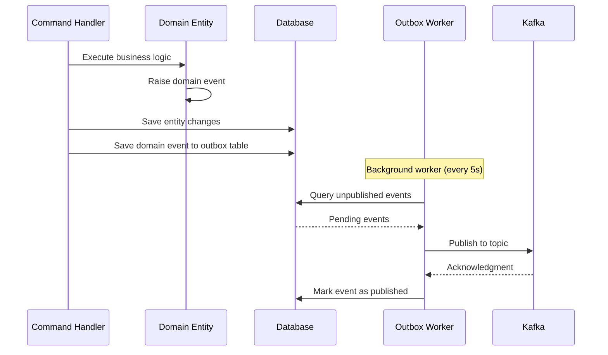
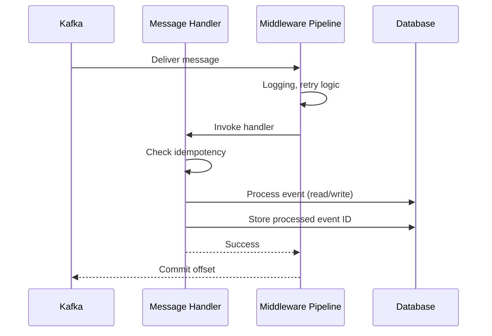

# System Architecture Documentation

## Table of Contents
1. [Architecture Overview](#architecture-overview)
2. [Architectural Patterns](#architectural-patterns)
3. [Domain-Driven Design](#domain-driven-design)
4. [Event-Driven Patterns](#event-driven-patterns)
5. [Data Architecture](#data-architecture)
6. [Messaging Architecture](#messaging-architecture)
7. [Service Details](#service-details)
8. [Integration Patterns](#integration-patterns)

---

## Architecture Overview

### Architecture Style
The EDA Mini E-Commerce system follows a **Modular Monolith Architecture** with **Event-Driven** communication patterns. The system is organized around business capabilities (Orders, Catalog, Billing) with clear bounded contexts, deployed as a single application.

### Key Architectural Characteristics

| Characteristic | Implementation |
|----------------|----------------|
| **Modularity** | Bounded contexts with separate projects per domain |
| **Scalability** | Event-driven communication enables future extraction of modules into services |
| **Resilience** | Asynchronous communication, retries, saga pattern for compensation |
| **Observability** | OpenTelemetry distributed tracing, structured logging |
| **Data Consistency** | Eventual consistency via event sourcing and saga orchestration |
| **Communication** | Asynchronous via Kafka within the same application |
| **Deployment** | Single deployment unit simplifies operations while maintaining modularity |

---

## Architectural Patterns

### 1. Modular Monolith Pattern

Each business capability is implemented as an independent module within a single application:

```
├── Orders Domain (Order processing, saga coordination)
├── Catalog Domain (Products, inventory management)
└── Billing Domain (Payments, billing records)
```

**Benefits:**
- Simplified deployment (single application)
- Shared infrastructure and resources
- Strong module boundaries via bounded contexts
- Easier development and debugging
- Foundation for future microservices if needed

**Characteristics:**
- Single database with schema separation
- In-process communication via events (through Kafka)
- All modules deployed together
- Modular code organization

### 2. CQRS (Command Query Responsibility Segregation)

Each domain service separates read and write operations:

```csharp
// Command side
POST /api/orders → CreateOrderCommand → OrderCommandHandler

// Query side
GET /api/orders/{id} → GetOrderQuery → OrderQueryHandler
```

**Implementation:**
- **Commands**: Modify state, publish domain events
- **Queries**: Read-only, optimized for specific views
- **MediatR**: In-process command/query bus

**Location**: 
- Commands/Queries: `src/{Domain}.Api/CQS/`
- Handlers: `src/{Domain}.Application/`

### 3. Saga Pattern (Orchestration)

Manages complex transactions across modules using a coordinator:

```
Order Saga Flow:
1. Order Created → Reserve Inventory
2. Inventory Reserved → Process Payment
3. Payment Success → Complete Order
4. Any Failure → Compensate (release inventory, refund)
```

**Implementation**: `Orders.SagaOrchestrator`
- Maintains saga state in database
- Publishes compensation events on failure
- Ensures eventual consistency

### 4. Outbox Pattern

Ensures reliable event publishing by storing events in the database transactionally:

```csharp
// Single transaction
using (var transaction = await _dbContext.Database.BeginTransactionAsync())
{
    // 1. Save domain changes
    _dbContext.Orders.Add(order);
    
    // 2. Save events to outbox table
    _dbContext.OutboxEvents.Add(new OutboxEvent 
    { 
        EventType = "order-created",
        Payload = JsonSerializer.Serialize(orderEvent)
    });
    
    await _dbContext.SaveChangesAsync();
    await transaction.CommitAsync();
}

// 3. Background worker publishes from outbox to Kafka
// Runs every N seconds, processes unpublished events
```

**Benefits:**
- Atomicity between state changes and event publishing
- No message loss even if Kafka is unavailable
- At-least-once delivery guarantee

**Implementation**: 
- Outbox tables: `outbox_integration_events`
- Workers: `{Domain}OutboxWorker.cs`

### 5. Domain-Driven Design (DDD)

Each bounded context follows DDD tactical patterns:

```
src/
├── Orders.Domain/        # Entities, Aggregates, Value Objects, Domain Events
├── Orders.Application/   # Use Cases, Command/Query Handlers
├── Orders.Infra/         # EF Core, Repositories, Outbox
└── Orders.Api/           # HTTP Endpoints
```

**Tactical Patterns:**
- **Entities**: Objects with identity (`Order`, `Product`, `Payment`)
- **Value Objects**: Immutable descriptive objects (`OrderId`, `Money`, `ProductId`)
- **Aggregates**: Consistency boundaries (`Order` aggregate includes `OrderItems`)
- **Domain Events**: Facts about state changes (`OrderCreated`, `PaymentProcessed`)
- **Repositories**: Abstraction over data persistence

---

## Domain-Driven Design

### Bounded Contexts

#### 1. Orders Context
**Responsibility**: Order lifecycle management

**Entities:**
- `Order`: Root aggregate
  - `OrderId` (strongly-typed ID)
  - `CustomerId`
  - `OrderStatus` (Pending, Confirmed, Cancelled)
  - `OrderItems` collection
  - `CreatedAt`, `UpdatedAt`

**Value Objects:**
- `OrderId`, `CustomerId`, `ProductId`
- `Money` (Amount + Currency)

**Domain Events:**
- `OrderCreatedEvent`: When order is initially placed
- `OrderCanceledEvent`: When order is cancelled
- `OrderItemRemovedEvent`: When item removed from order
- `ProductReservationStatusEvent`: Inventory reservation result

**Aggregates:**
- `Order` (root) → `OrderItems` (entities within aggregate)

#### 2. Catalog Context
**Responsibility**: Product and inventory management

**Entities:**
- `Product`: Product information
  - `ProductId`
  - `Name`, `Description`
  - `Price`
  - `IsActive` status
  
- `InventoryItem`: Stock tracking
  - `ProductId`
  - `QuantityAvailable`
  - `ReservedQuantity`

**Domain Events:**
- `ProductDeactivatedEvent`: Product no longer available
- `ProductReservedEvent`: Stock reserved for order
- `ProductLowStockEvent`: Inventory below threshold

#### 3. Billing Context
**Responsibility**: Payment processing and billing

**Entities:**
- `Payment`
  - `PaymentId`
  - `OrderId`
  - `Amount`
  - `PaymentStatus` (Pending, Processed, Failed)
  - `ProcessedAt`

**Domain Events:**
- `PaymentProcessedEvent`: Payment completed (success or failure)

### Strongly-Typed IDs

All entities use strongly-typed IDs to prevent primitive obsession:

```csharp
public record OrderId(Guid Value);
public record ProductId(Guid Value);
public record CustomerId(Guid Value);
public record PaymentId(Guid Value);
```

**Benefits:**
- Type safety (can't mix OrderId with ProductId)
- Self-documenting code
- Easier refactoring

---

## Event-Driven Patterns

### Event Types

#### 1. Domain Events
**Scope**: Within a bounded context  
**Purpose**: Internal business logic reactions  
**Location**: `{Domain}.Domain/Entities/Events/`

```csharp
public class OrderCreatedEvent : IDomainEvent
{
    public OrderId OrderId { get; set; }
    // Raised when Order aggregate changes state
}
```

#### 2. Integration Events
**Scope**: Cross-bounded context  
**Purpose**: Inter-service communication  
**Location**: `Platform.SharedContracts/IntegrationEvents/`

```csharp
public class ProductReservationEvent
{
    public OrderId OrderId { get; init; }
    public ProductId ProductId { get; init; }
    public int Quantity { get; init; }
    public ReservationEventType ReservationType { get; init; }
}
```

### Event Publishing Flow



### Event Consumption Flow



---

## Data Architecture

### Database Strategy: Shared Database with Schema Separation

This implementation uses a **shared PostgreSQL database** with logical separation through schemas (modular monolith pattern):

```sql
-- Orders schema
CREATE SCHEMA IF NOT EXISTS orders;
CREATE TABLE orders.orders (...);
CREATE TABLE orders.order_items (...);
CREATE TABLE orders.saga_events (...);
CREATE TABLE orders.outbox_integration_events (...);

-- Catalog schema
CREATE SCHEMA IF NOT EXISTS catalog;
CREATE TABLE catalog.products (...);
CREATE TABLE catalog.inventory_items (...);
CREATE TABLE catalog.outbox_integration_events (...);

-- Billing schema
CREATE SCHEMA IF NOT EXISTS billing;
CREATE TABLE billing.payments (...);
CREATE TABLE billing.outbox_integration_events (...);
```

**Rationale:**
- Consistent with modular monolith architecture
- Simpler local development
- Easier transaction management
- Reduced operational complexity
- Schema separation maintains module boundaries
- Can be split into separate databases when evolving to microservices

### Entity Framework Core Configuration

**Naming Convention**: Snake_case for database objects
```csharp
// Using EFCore.NamingConventions
services.AddDbContext<OrdersDbContext>(options =>
    options.UseNpgsql(connectionString)
           .UseSnakeCaseNamingConvention());
```

**Example:**
- C# Property: `OrderId` → Database Column: `order_id`
- C# Table: `Orders` → Database Table: `orders`

### Outbox Tables

Each bounded context has its own outbox table:

```sql
CREATE TABLE outbox_integration_events (
    id UUID PRIMARY KEY,
    event_type VARCHAR(255) NOT NULL,
    payload JSONB NOT NULL,
    created_at TIMESTAMP NOT NULL,
    processed_at TIMESTAMP,
    error_message TEXT
);

CREATE INDEX idx_outbox_unprocessed 
ON outbox_integration_events(processed_at) 
WHERE processed_at IS NULL;
```

---

## Messaging Architecture

### Apache Kafka Configuration

**Broker**: Single Kafka broker (can be scaled to cluster)
- Port: 59481
- Managed by .NET Aspire

**Topics**: One topic per event type

| Topic Name | Partitions | Producers | Consumers |
|------------|------------|-----------|-----------|
| `order-created` | 1 | Orders.Api | Orders.SagaOrchestrator |
| `product-reservation` | 1 | Orders.SagaOrchestrator | Catalog.InventoryWorker |
| `product-reserved` | 1 | Catalog.InventoryWorker | Orders.SagaOrchestrator |
| `payment-pending` | 1 | Orders.SagaOrchestrator | Billing.PaymentWorker |
| `payment-processed` | 1 | Billing.PaymentWorker | Orders.SagaOrchestrator |
| `product-deactivated` | 1 | Catalog.Api | Catalog.InventoryWorker |

### KafkaFlow Configuration

**Producer Example:**
```csharp
services.AddKafkaFlowHostedService(kafka => kafka
    .AddCluster(cluster => cluster
        .WithBrokers(new[] { messageBrokerConfig.BootstrapServers })
        .CreateTopicIfNotExists("order-created", 1, 1)
        .AddProducer("order-producer", producer => producer
            .DefaultTopic("order-created")
            .AddMiddlewares(middlewares => middlewares
                .AddSerializer<JsonCoreSerializer>()
            )
        )
    )
);
```

**Consumer Example:**
```csharp
.AddConsumer(consumer => consumer
    .Topic("order-created")
    .WithGroupId("order-saga-orchestrator")
    .WithBufferSize(100)
    .WithWorkersCount(10)
    .WithAutoOffsetReset(AutoOffsetReset.Earliest)
    .AddMiddlewares(middlewares => middlewares
        .AddDeserializer<JsonCoreDeserializer>()
        .AddTypedHandlers(handlers => handlers
            .AddHandler<OrderCreatedMessageHandler>()
        )
    )
)
```

**Key Configuration Options:**
- `WithGroupId`: Consumer group for offset management
- `WithWorkersCount`: Parallel message processing
- `AutoOffsetReset`: Start from beginning (`Earliest`) or end (`Latest`)
- `WithBufferSize`: Internal message buffer size

### Message Serialization

**Format**: JSON (via `KafkaFlow.Serializer.JsonCore`)

**Example Message:**
```json
{
  "orderId": {
    "value": "3fa85f64-5717-4562-b3fc-2c963f66afa6"
  },
  "productOrderInfos": [
    {
      "productId": {
        "value": "7c9e6679-7425-40de-944b-e07fc1f90ae7"
      },
      "quantity": 2
    }
  ]
}
```

---

## Service Details

### EdaMicroEcommerce.Api (Main API)

**Purpose**: Main application API and event publishing coordinator

**Technology Stack:**
- ASP.NET Core 8.0
- Carter (minimal APIs)
- Swagger/OpenAPI

**Responsibilities:**
1. HTTP endpoint aggregation
2. Cross-cutting concerns (exception handling, logging)
3. Host outbox workers for all domains
4. OpenTelemetry instrumentation

**Configuration Files:**
- `appsettings.json`: Connection strings, Kafka config
- `Program.cs`: Service registration and middleware pipeline

### Orders.SagaOrchestrator

**Purpose**: Coordinate order workflow across modules

**Key Components:**
- `OrderCreatedMessageHandler`: Initiates saga
- `ProductReservedMessageHandler`: Continues to payment
- `PaymentProcessedMessageHandler`: Completes or compensates saga
- `SagaEvent` entity: Persists saga state

**State Machine:**
```
[Order Created] → Reserve Inventory
    ↓ Success
[Inventory Reserved] → Process Payment
    ↓ Success
[Payment Success] → Complete Order
    ↓ Failure (any step)
[Compensation] → Release inventory, cancel order
```

### Catalog.InventoryWorker

**Purpose**: Manage inventory reservations and stock levels

**Handlers:**
- `ProductInventoryReservationHandler`: Reserve/release stock
- `ProductDeactivatedMessageHandler`: Handle product deactivation

**Business Logic:**
```csharp
// Reserve inventory
if (availableQuantity >= requestedQuantity)
{
    inventory.ReservedQuantity += requestedQuantity;
    await PublishProductReservedEvent(success: true);
}
else
{
    await PublishProductReservedEvent(success: false);
}
```

### Billing.PaymentWorker

**Purpose**: Process payments (simulated)

**Handler:**
- `PaymentPendingHandler`: Processes payment, publishes result

**Simulation Logic:**
```csharp
// Simulate payment processing
var paymentSuccessful = Random.Next(0, 10) < 9; // 90% success rate
var payment = new Payment
{
    OrderId = message.OrderId,
    Amount = message.TotalAmount,
    Status = paymentSuccessful ? "Processed" : "Failed"
};

await PublishPaymentProcessedEvent(payment);
```

---

## Integration Patterns

### Request-Reply Pattern (Saga Orchestration)

The saga orchestrator uses request-reply pattern through events:

```
Request: product-reservation event
Reply: product-reserved event

Request: payment-pending event  
Reply: payment-processed event
```

**Correlation**: `OrderId` used to correlate requests with replies

### Publish-Subscribe Pattern

Product deactivation uses pub-sub across modules:

```
Publisher: Catalog.Api
Event: product-deactivated
Subscribers: 
  - Catalog.InventoryWorker (update stock)
  - Orders.SagaOrchestrator (cancel pending orders - future)
  - Notifications.Module (alert users - future)
```

### Competing Consumers Pattern

Multiple instances of a worker share the load:

```
Topic: payment-pending (3 partitions)
Consumer Group: billing-payment-worker
Instances: 3 workers

Kafka distributes partitions across instances:
  Worker 1 → Partition 0
  Worker 2 → Partition 1  
  Worker 3 → Partition 2
```

---

## Scalability Considerations

### Horizontal Scaling

**Note**: As a modular monolith, the entire application scales as a unit. For independent module scaling, consider extracting modules into separate microservices.

**Current Scaling Options**:
```bash
# Scale the entire application
kubectl scale deployment eda-ecommerce --replicas=3
```

**Kafka Partitioning**: Increase partitions for higher throughput
```bash
# Increase partitions for order-created topic
kafka-topics --alter --topic order-created --partitions 10
```

### Database Scaling

**Read Replicas**: For query-heavy operations
```csharp
services.AddDbContext<ReadOnlyOrdersDbContext>(options =>
    options.UseNpgsql(readReplicaConnectionString)
           .UseQueryTrackingBehavior(QueryTrackingBehavior.NoTracking));
```

**Sharding**: Future option to split database by tenant or region

---

## Security Considerations

### Event Data
- **PII**: Avoid sensitive data in events (use references)
- **Encryption**: Consider encrypting event payload at rest in Kafka

### API Security (Future Enhancements)
- Authentication (JWT, OAuth 2.0)
- Authorization (role-based, policy-based)
- Rate limiting
- Input validation

### Database Security
- Connection string encryption
- Least privilege database users
- Audit logging

---

## Future Architecture Enhancements

1. **Extract to Microservices**: Individual modules can be extracted into separate services as scaling needs grow
2. **Event Sourcing**: Store all state changes as events
3. **CQRS with Separate Read Models**: Dedicated read databases
4. **API Gateway**: Centralized routing, authentication, rate limiting (if extracting to microservices)
5. **Service Mesh**: Istio/Linkerd for advanced traffic management (if extracting to microservices)
6. **Separate Databases**: Database-per-service isolation (when moving to microservices)
7. **Dead Letter Queues**: Handle poison messages
8. **Circuit Breakers**: Prevent cascading failures
9. **API Versioning**: Support multiple API versions
